# 🛒 10-minute Delivery platform

A full-stack grocery delivery platform that connects local vendors with customers for fast and reliable essentials delivery.

---

## ✨ Key Features

- **Multi-role System**  
  Separate interfaces for **Customers**, **Vendors**, and **Delivery Partners**.

- **Location-Based Services**  
  Integrated with **Google Maps API** for address search and selection.

- **Real-time Inventory**  
  Live product tracking using **MySQL** database.

- **Shopping Cart**  
  Add/remove items with **quantity control**.

- **Order Tracking**  
  Customers and vendors get **live order status updates**.

- **Secure Authentication**  
  **JWT-based** login system with **bcryptjs** for password encryption.

- **Admin Dashboard**  
  Manage users, products, and orders from a single place.

---

## 💻 Tech Stack

### Frontend

- **Core:** HTML5, CSS3, JavaScript (ES6+)
- **UI Components:** Custom CSS, [Font Awesome](https://fontawesome.com/)
- **Maps Integration:** Google Maps JavaScript API + Places Autocomplete
- **Responsive Design:** Mobile-first approach

### Backend

- **Server:** Node.js with Express.js
- **Database:** MySQL (Relational schema)
- **Authentication:** bcryptjs for hashing, JWT for sessions
- **Security:** Crypto for secure password resets
- **Email Services:** Nodemailer for OTPs and notifications
- **File Uploads:** Multer for image handling

### APIs

- **Google Maps API:** For address suggestions and geolocation
- **Custom REST API:** 50+ endpoints for handling user actions, products, orders, and more

---

## ⚙️ Installation

### 🔧 Prerequisites

- Node.js (v14 or above)
- MySQL (v8 or above)
- Google Cloud API Key with:
  - Maps JavaScript API enabled
  - Places API enabled

### 🚀 Setup Instructions

1. **Clone the repository**
   ```bash
   git clone https://github.com/sumankr15/Minutemart.git

    
## 🖼️ Screenshots
### 🔐 Login Page
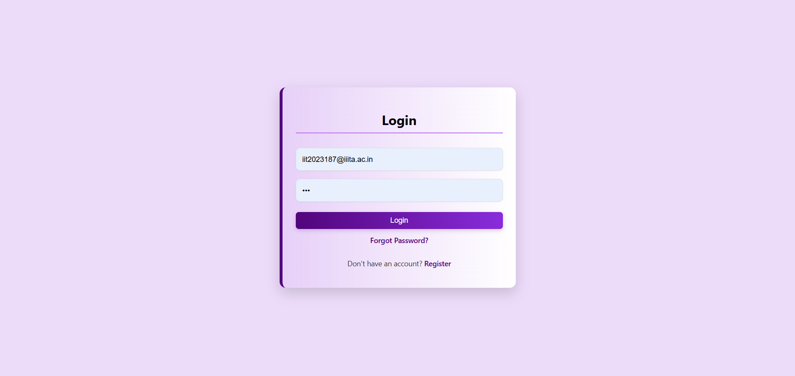

### 🔐 Reset PassWord
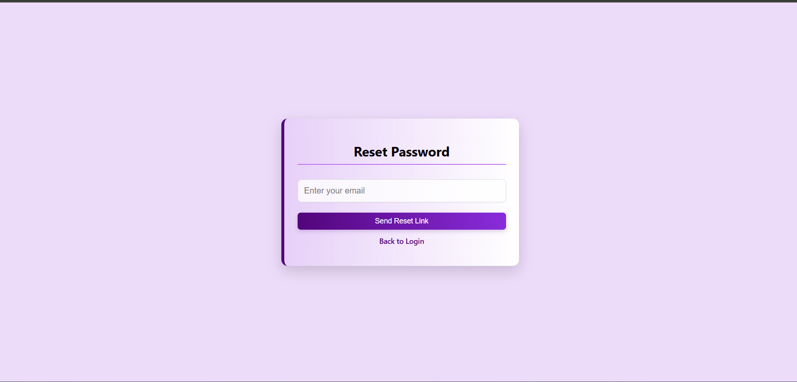

### 🧾Admin Dashboard
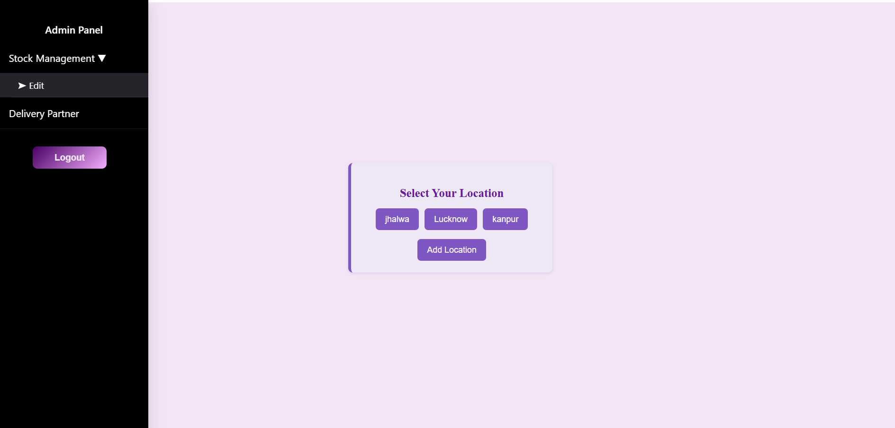
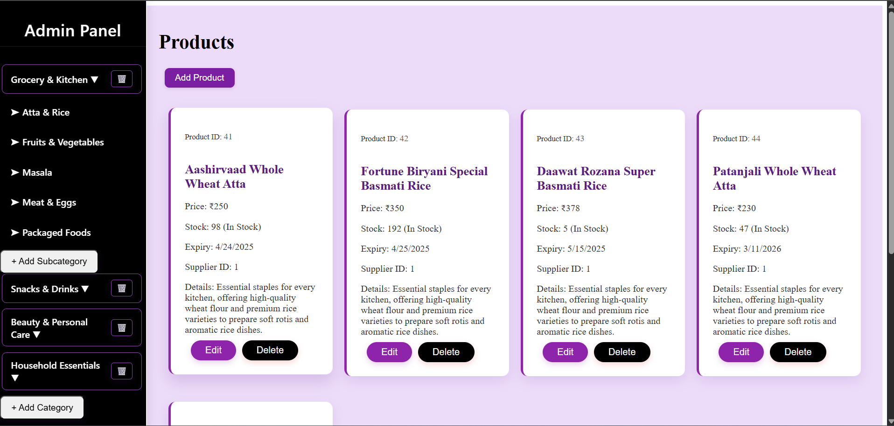
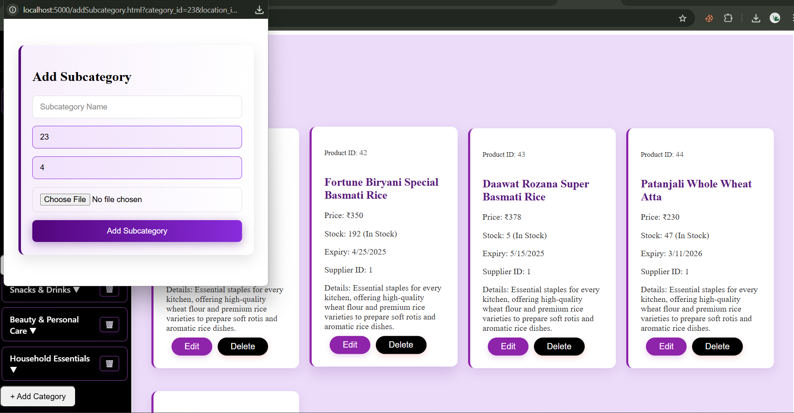

### 🧾Adding Products 
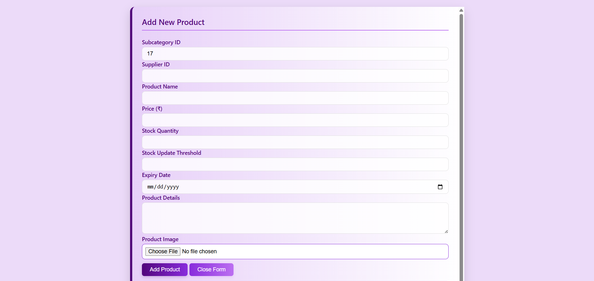


### 🧾Adding Delivery Partner By Admin
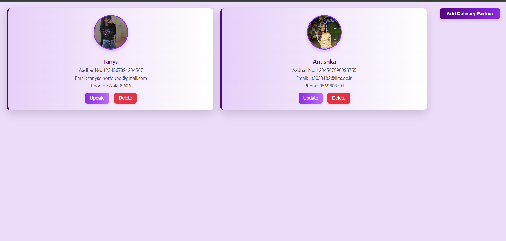

### 🧾Real Time Location Selection By Users
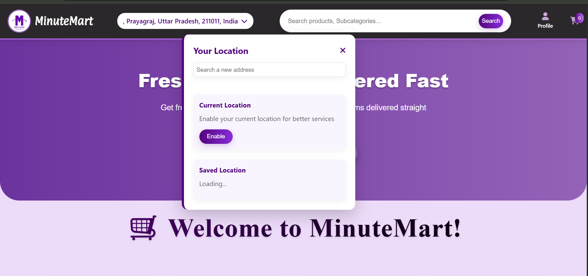

### 🧾Category of Products
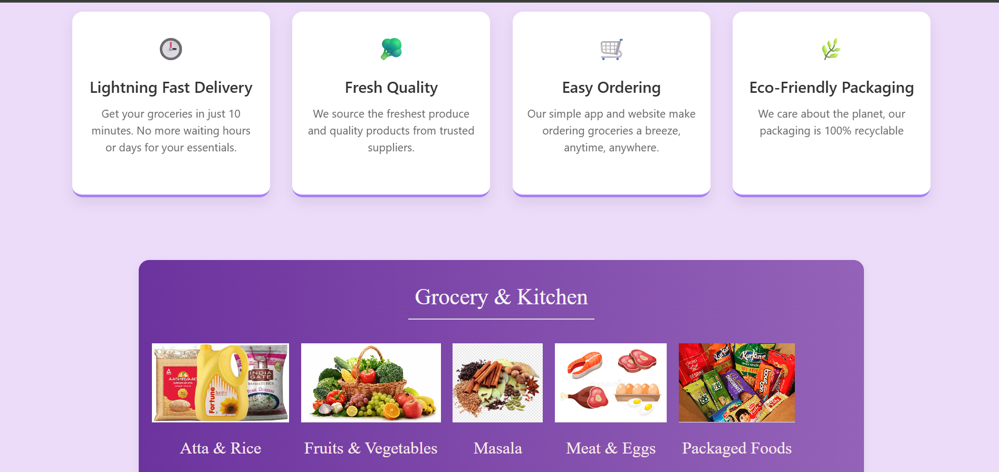

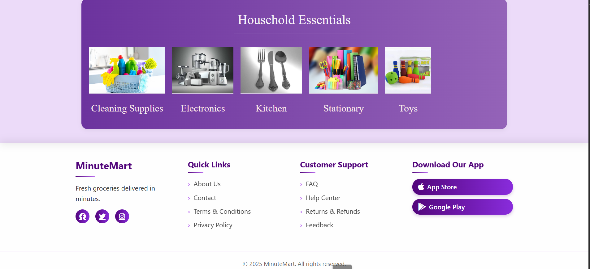

### 🧾Product Page
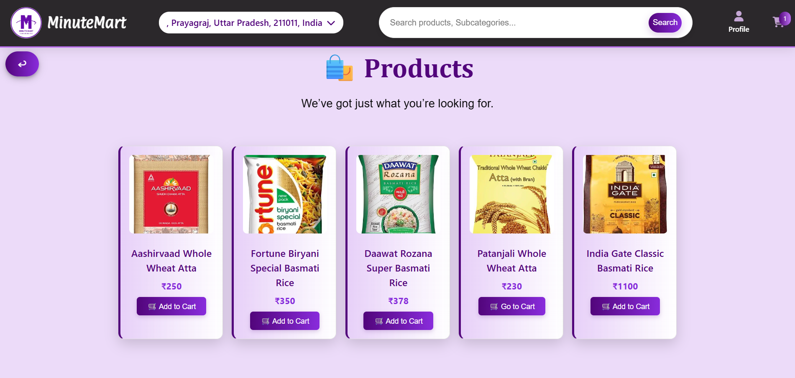

### 🧾Cart
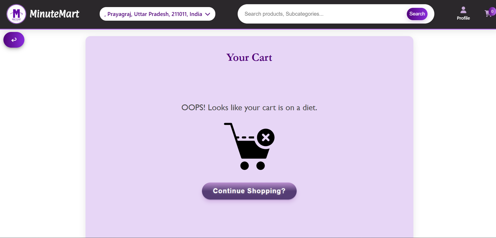
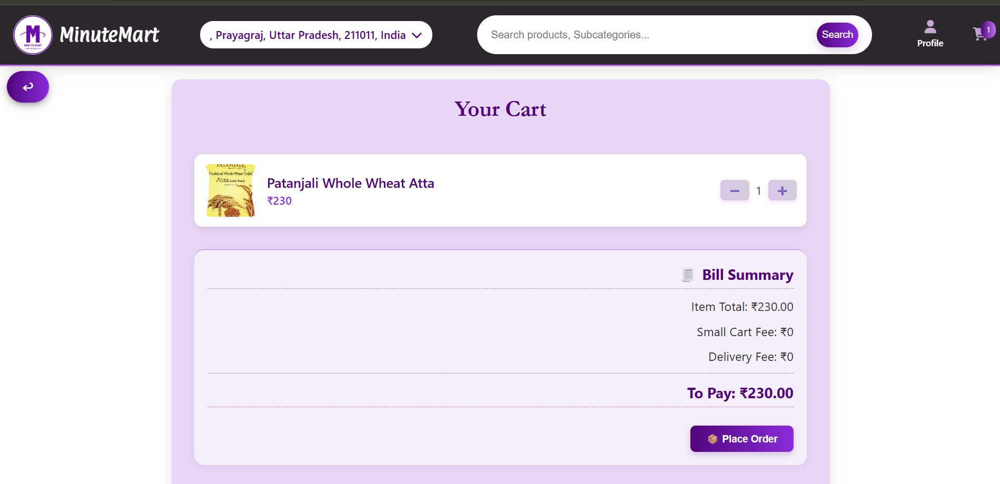

### 🧾User Profile 
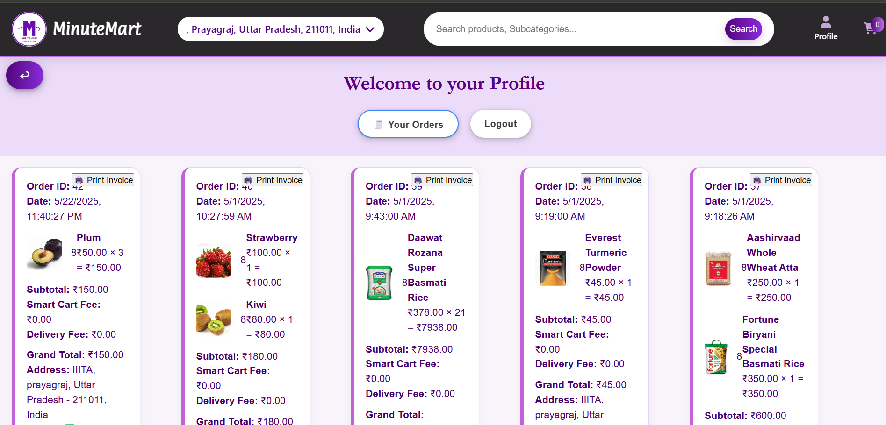

### 🧾FAQs Page
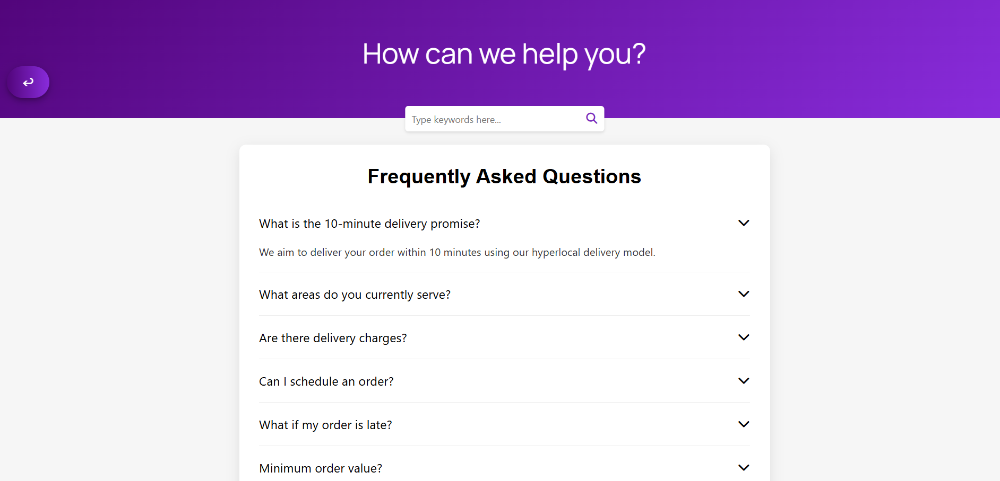

### 🧾Delivery Partner Order Assignment
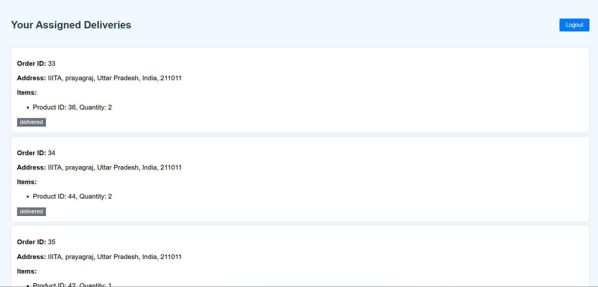


 
